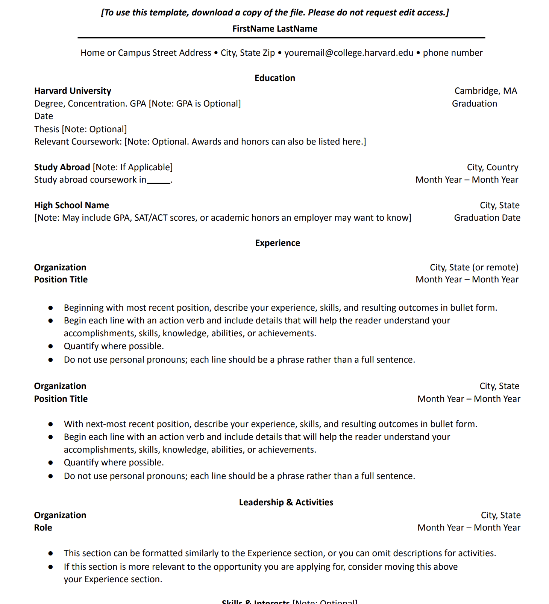

# Frontend Technical Specification

- Create a static website that serves an html resume

## Resume Format Considerations

Resume is supposed to exclude Photos, follow a STAR format and should not exceed one page in limit.

I am going to use a standard one page Resume based on the [Harward Resume Template](https://docs.google.com/document/d/1EujuYFWxVXZ2PUaJ2uizvK5raMoMsz1KMys-UYpUSk4/edit?tab=t.0).

### Harward Resume Format Generation

I know HTML very well, so I'm going to let GenAI do the heavy lifting
and generate out the HTML and CSS and from there I will refactor the code to the prefered standard.

Prompt to ClaudeAI:

```text
Convert this resume format into html.
Please don't use a css framework.
Please use the least amount of css tags.
```

Image passed to the LLM.


This is the [generated output](./docs/Nov-23-2025-resume.html) which I will refactor.