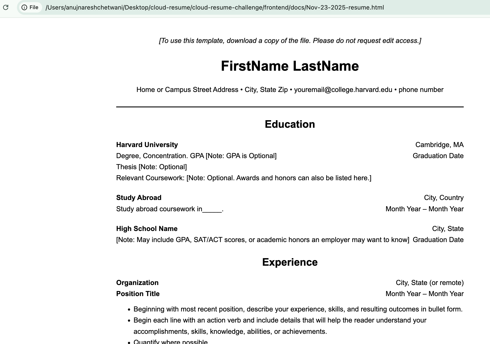

# Frontend Technical Specification

- Create a static website that serves an html resume

## Resume Format Considerations

Resume is supposed to exclude Photos, follow a STAR format and should not exceed one page in limit.

I am going to use a standard one page Resume based on the [Harward Resume Template](https://docs.google.com/document/d/1EujuYFWxVXZ2PUaJ2uizvK5raMoMsz1KMys-UYpUSk4/edit?tab=t.0).

### Harward Resume Format Generation

I know HTML very well, so I'm going to let GenAI do the heavy lifting
and generate out the HTML and CSS and from there I will refactor the code to the prefered standard.

Prompt to ClaudeAI:

```text
Convert this resume format into html.
Please don't use a css framework.
Please use the least amount of css tags.
```

Image passed to the LLM.


This is the [generated output](./docs/Nov-23-2025-resume.html) which I will refactor.

This is what the generated HTML looks like unaltered


## HTML Adjustment

- I plan to use only English Language.
- For mobile styling to our website we'll include the viewport meta tag width=device-width.
- We will extraxt our styles into its own stylesheet after we are happy with our mark up.
- The goal is to simplify the markers as much as possible.
- For the HTML page I will use 4 spaces as I mostly code in Python.

## Serve Static Website Locally

We need to serve our static website locally so we can start using stylesheets externally from our HTML page in a Cloud Developer Env. (CDE).

> This is not necessary with local development.


### Install HTTP Server
```sh
npm i http-server -g
```

https://www.npmjs.com/package/http-server

### Server Website

http-server will serve a public folder by default where the command is run.

```sh
cd frontend
http-server
```

### Frontend Framework Consideration

- Choose to use react becuase it is the most popular framework.
- Choose to use Vite.js ober webpack because our frontend is very simple.
- Configure React Roouter V7, decided to use declartive mode because again our app is very simple.